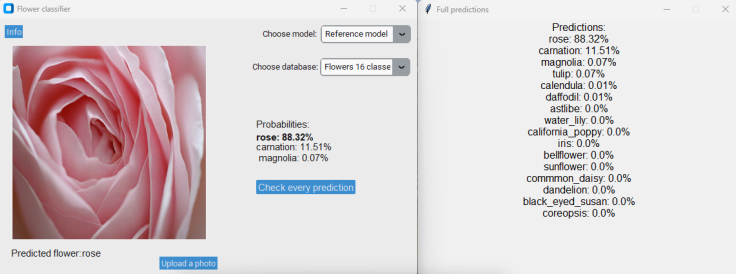

# Image Classifier using Neural Networks

This is a college project for an image classifier using neural networks implemented in Python. The project is a collaborative effort by a team of three students. The goal is to build and compare three different models for image classification: Convolutional Neural Network (CNN), Teacher-Student model, and CNN with pruning. Additionally, a simple neural network model has been implemented, albeit with poor performance.

## Models

1. **Convolutional Neural Network (CNN):** The team has implemented a CNN model for image classification. CNNs are widely used for image analysis tasks due to their ability to capture spatial hierarchies and extract meaningful features from images.

2. **Teacher-Student model:** In addition to the CNN model, the team has implemented a Teacher-Student model. This model involves training a smaller neural network (student) to mimic the predictions of a larger, pre-trained neural network (teacher). This approach aims to improve the performance of the student model by leveraging the knowledge learned by the teacher model.

3. **CNN with Pruning:** The team has also implemented a CNN model with pruning. Pruning is a technique used to reduce the size of neural networks by removing unnecessary connections and parameters, leading to improved efficiency and potentially better generalization.

4. **Simple Neural Network Model:** Apart from the three main models, the team has created a simple neural network model. However, this model performs poorly compared to the other models.

## Interface

An interface has been developed to interact with the image classifier models. Users can upload their own photos and obtain predictions for the flower's name using one of the implemented models. The interface provides a user-friendly way to explore the capabilities of the models and observe their performance on various images.



The app itself is available in the releases. It also contains all the models needed to run the app. 


## Project Structure

The rest of the project contains code that was used to create every model and prepare the report that is available only in Polish under `report/kwiaty.pdf`
The project repository follows the following structure:

```
- app/                       # Directory for the user interface
    - app.py                 # Code for the user interface
    - app_parameters.py      # Parameters for the user interface
    
- cnn/                       # Directory for the CNN model
    - cnn_model.py           # Code for the CNN model

-pruning/                    # Directory for the pruning model
    - pruning_model.py       # Code for the pruning model
    
- ref_model/                 # Directory for the reference model
    - ref_model.py           # Code for the reference model
    
- simple/                    # Directory for the simple neural network model
    - main.py                # Code for the simple model's main script
    - data.py                # Code to convert images to a specific format and save them to .csv file
    - model_methods.py       # Code for simple model functions
    - params.npz             # Parameters for the simple model
    
- report/ 
    - kwiaty.pdf             # College report of the project
- README.md                  # Read me
- requirements.txt           # Libraries for the project
```


## Getting Started


1. Clone the project repository:

```bash
git clone https://github.com/komeg1/si-proj.git
cd si-proj
```

2. Set up the Python environment and install the required dependencies:

```bash
pip install -r requirements.txt
```

3. Ensure that the datasets are located in the `flowers/`, `flowers2/`, `flowers3/` directories.

4. Download `models/` and `inceptionv3/` directories that contain models for the app and put them in the main directory.

5. Run the user interface:

```bash
cd app
python app.py
```


6.To use the CNN model, navigate to the `cnn/` directory and run the following command:

```bash
python cnn_model.py
```

7, To use the reference model, navigate to the `ref_model/` directory and run the following command:

```bash
python ref_model.py
```

8, To use the pruning model, navigate to the `pruning/` directory and run the following command:

```bash
python ref_model.py
```
9. To use the simple neural network model, navigate to the `simple/` directory and run the following command:

```bash
python main.py
```

Make sure to adjust any file paths or configurations within the code according to your setup and requirements.

## Conclusion

This project provides an image classifier with various models implemented using neural networks. The user interface allows easy interaction with the models by uploading images and obtaining predictions. Additionally, there are separate scripts for the CNN model, reference model, and a simple neural network model. Explore the different models and their performance, and feel free to modify the code to suit your specific needs.

## Authors

Robert Kalinowski

Julia Chomicka

Tomasz Krezymon

## Models and databases
The models are also available directly in the [release](https://github.com/komeg1/flower-classificator-ai-proj/releases/).

`models/` - https://drive.google.com/file/d/1Bhw3rUZs_emm64JT1ZOKZf-onSjo1UHs/view?usp=sharing

`inceptionv3/` - https://drive.google.com/file/d/18rPzlZPDlDFDfYt4CdrINGAg7QcPtEm2/view?usp=sharing

`flowers/` - https://www.kaggle.com/datasets/alxmamaev/flowers-recognition

`flowers2/` - https://www.kaggle.com/datasets/l3llff/flowers

`flowers3/` - https://www.kaggle.com/datasets/nadyana/flowers

## References
- Loss function of the distilled model:
http://cs231n.stanford.edu/reports/2016/pdfs/120_Report.pdf
- Example of knowledge distillation model:
https://keras.io/examples/vision/knowledge_distillation/
- Example of pruning model:
https://colab.research.google.com/github/matthew-mcateer/Keras_pruning/blob/master/Model_pruning_exploration.ipynb#scrollTo=BXrVJhdZ5P4P
